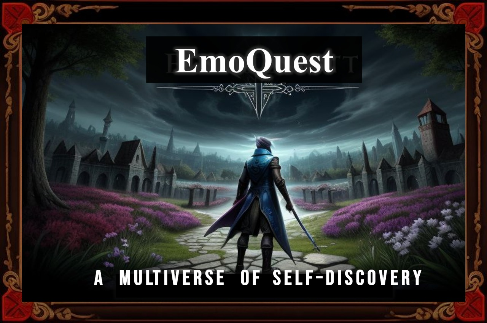
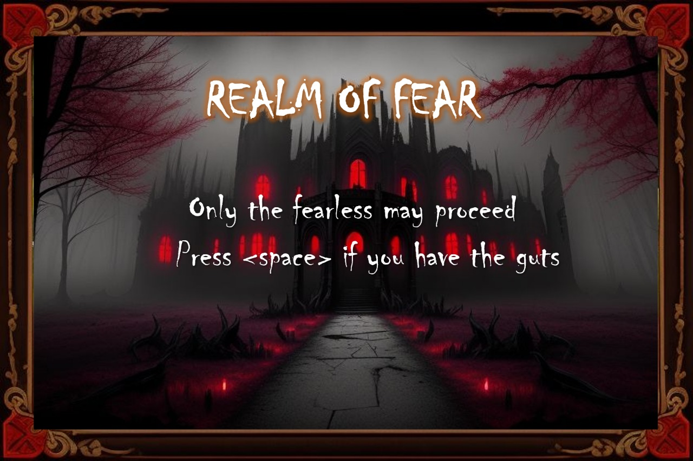
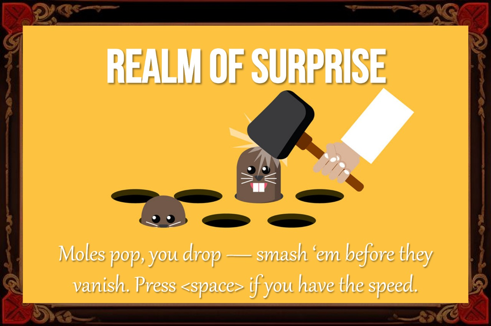
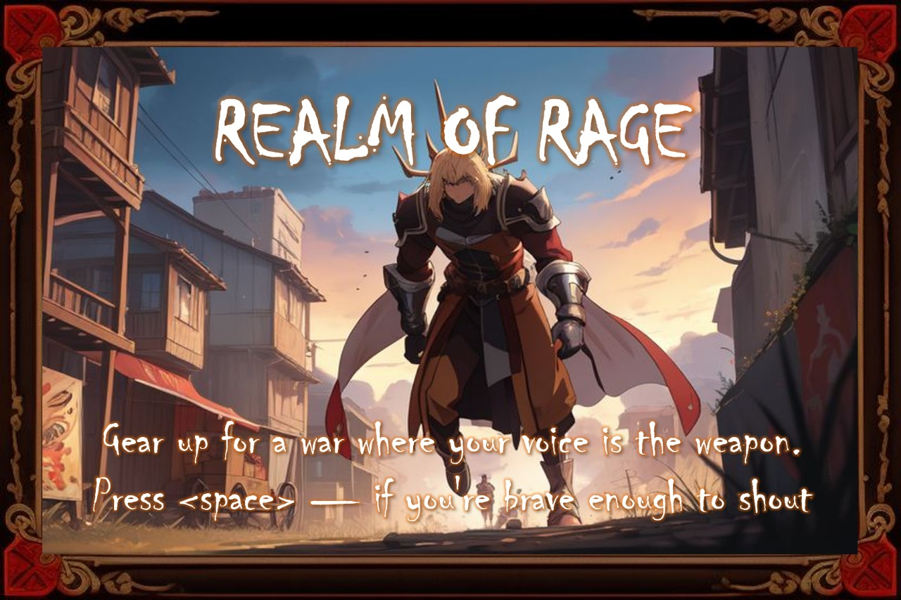
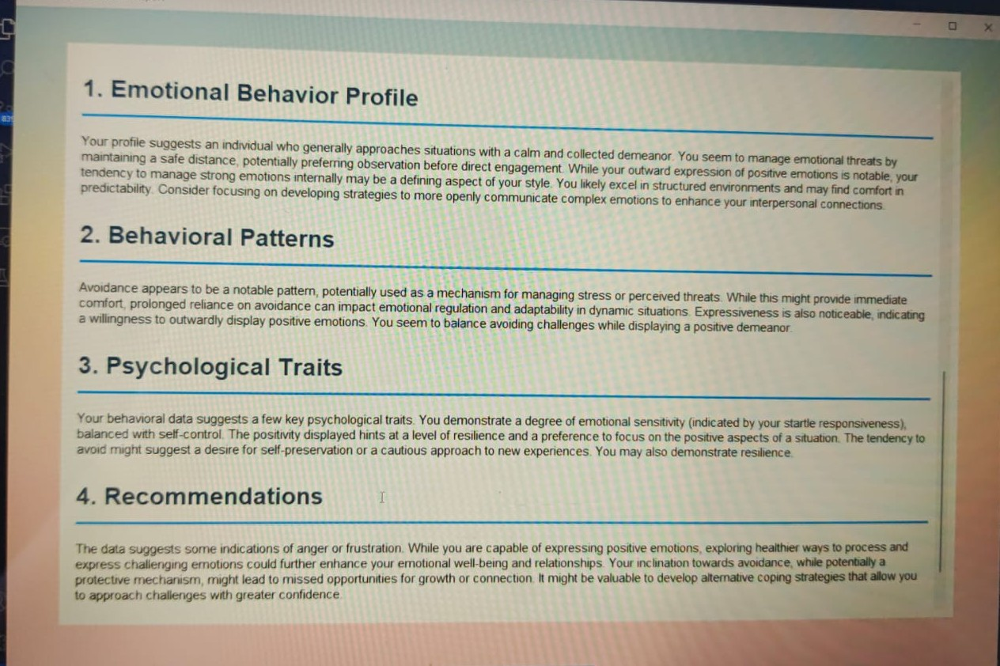

# 🎮 EmoQuest: Exploring Emotions Through Gameplay



**EmoQuest** is an immersive behavioral analytics game designed to detect affective patterns through interactive gameplay. Players journey through four uniquely designed emotional realms—**Fear**, **Surprise**, **Pleasure**, and **Rage**—each crafted to trigger, measure, and analyze specific behavioral and emotional responses. 

Through state-of-the-art tracking systems—ranging from voice and eye tracking to facial emotion recognition—EmoQuest delivers deep insights into expressive patterns, emotional reactivity, and potential behavioral anomalies.

---

## 👻 Realm of Fear: Defensive Avoidance Detection



In the **Realm of Fear**, players must escape a terrifying witch, navigating through eerie environments powered by chilling audio and unexpected jump scares. 

🧠 **Behavioral Analytics**:
- **Stimulus:** Fearful music, jump scares
- **Tracked Metrics:** Heart rate spikes (via simulated input), escape timing, power-up use
- **Detected Behavior:** Defensive avoidance patterns

---

## 🎉 Realm of Surprise: Startled Reactivity Analysis



A fast-paced **whack-a-mole** style challenge awaits in the **Realm of Surprise**. Surprises emerge randomly, requiring rapid reaction and decision-making.

🧠 **Behavioral Analytics**:
- **Stimulus:** Sudden visual and auditory changes
- **Tracked Metrics:** Reaction time, accuracy, startled movement patterns
- **Detected Behavior:** Startle responsiveness and adaptability

---

## 😊 Realm of Pleasure: Expressive Positivity Assessment


The **Realm of Pleasure** can only be conquered with joy—literally. Players must smile to unlock controls using a real-time face and eye detection model.

🧠 **Behavioral Analytics**:
- **Stimulus:** Calming visuals and pleasant audio
- **Tracked Metrics:** Smile duration and intensity, blink frequency, eye tracking
- **Detected Behavior:** Expressive positivity, emotional stability

---

## 🌋 Realm of Rage: Confrontational Reactivity Monitoring



In the **Realm of Rage**, players fight using only their **voice**. Shouts, commands, and vocal intensity power attacks and defense mechanisms.

🧠 **Behavioral Analytics**:
- **Stimulus:** Aggressive opponents, voice-controlled combat
- **Tracked Metrics:** Voice pitch, tone, intensity, timing
- **Detected Behavior:** Confrontational reactivity, stress vocal patterns

---

## 📊 Comprehensive Behavioral Report



After completing all four realms, players receive a detailed report summarizing their behavioral patterns across different emotional states.

📋 **Report Includes**:
- Affective response profiling
- Comparative behavioral data
- Alerts for abnormal patterns
- Recommendations for further assessment (if needed)

---

## 🚀 Getting Started

1. Clone this repository:
   ```bash
   git clone https://github.com/your-username/emoquest.git
   cd emoquest
